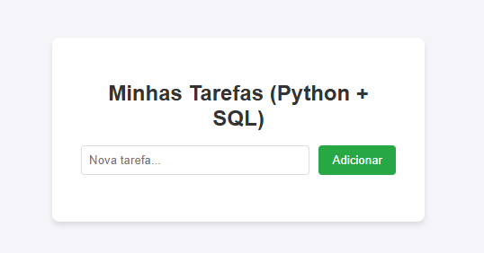

# Gerenciador de Tarefas (To-Do List)

Projeto desenvolvido para demonstrar competências em desenvolvimento Web Fullstack com Python, aplicação de lógica de programação e manipulação de banco de dados SQL.


## 📸 Demonstração


## 🚀 Tecnologias Utilizadas

* **Linguagem:** Python
* **Framework Web:** Flask (Implementação de rotas e lógica MVC)
* **Banco de Dados:** SQLite (via SQLAlchemy)
* **Front-end:** HTML5 e CSS3

## ⚙️ Funcionalidades (v2.0)

O sistema conta com recursos avançados de Front-end e Back-end:
* **CRUD Completo:** Criação, leitura, atualização e exclusão de tarefas.
* **Categorização:** Organização por tags (Pessoal, Trabalho, Estudo, Urgente) com armazenamento no banco SQL.
* **Dark Mode:** Tema escuro/claro com persistência de preferência do usuário (via `localStorage` e CSS Variables).
* **Interface Responsiva:** Design moderno adaptável a diferentes telas.

## 🔧 Como rodar o projeto

1.  Clone o repositório:
    ```bash
    git clone [https://github.com/JeffersonLudwig/gerenciador-tarefas.git](https://github.com/JeffersonLudwig/gerenciador-tarefas.git)
    ```
2.  Entre na pasta:
    ```bash
    cd gerenciador-tarefas
    ```
3.  Instale as dependências:
    ```bash
    pip install -r requirements.txt
    ```
4.  Execute a aplicação:
    ```bash
    python app.py
    ```
5.  Acesse no navegador: `http://127.0.0.1:5000`

---
Desenvolvido por **Jefferson Alan Schmidt Ludwig**
[LinkedIn](https://www.linkedin.com/in/jefferson-alan-schmidt-ludwig-980a66280/)